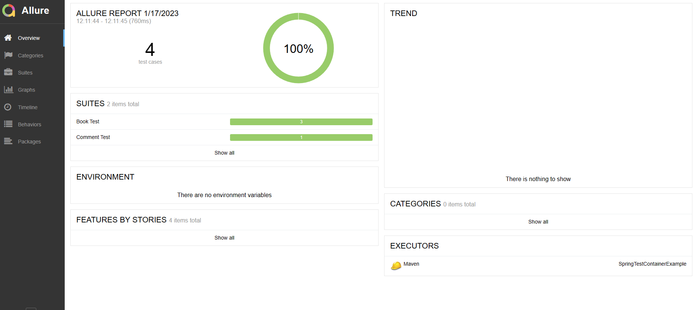

# Spring Boot Test Container Example code

This repository is about using Test container on Spring Boot. There are separated example of using Test container, first of all using PostgreSQL container.

Later, i will add using kafka and mockserver container

## Features

- BookController and BookControllerTests class
- CommentController class

## How to run
`git clone https://github.com/farhanatsani/spring-test-container-example`

- For manually test, you must connect to postgresql either using docker or installing on your machine
- Run with following command :
   
`mvn clean install`
 `mvn spring-boot:run`
   
And you can manually test using postman, insomnia, etc
   
- For automation test, you're not required to connect postgresql
- Just run with following command :
   
`mvn test -Dtest=BookControllerTests`

## Generate Allure Report
We can generate allure report with following command :
   
`mvn clean test allure:report`
 `mvn allure:serve`

